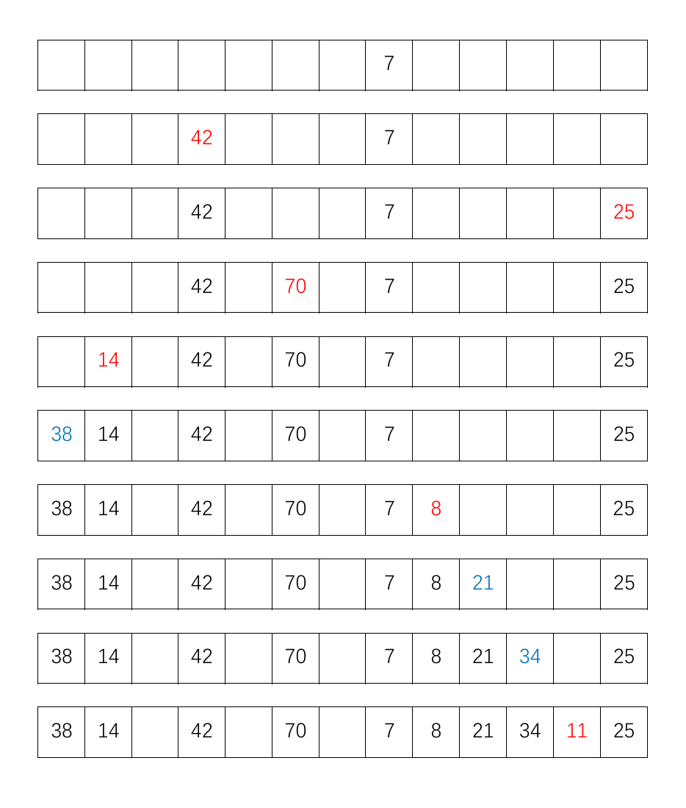

## 1

插入图如下，红色是此步骤插入的关键字，蓝色是此步骤插入的因冲突所以使用线性探查法解决冲突插入的关键字

## 2

设散列表桶数为$b$，插入元素个数为$n$，计算得到的负载因子为$\alpha$。由题目条件：$b=13$，$n=10$，因此：

$$
α=\frac{n}{b}=\frac{10}{13}\approx0.77
$$

## 3

由插入图可知，对于一次失败的搜索，假定我们搜索的元素为$k$，其哈希为$i$，即$i=f(k)=k\%13$，那么对于$i\in\left[0,12\right]$，对应的搜索桶数应当为：

$$ \left[3,2,1,2,1,2,1,9,8,7,6,5,4\right] $$

这是由于一次错误的搜索必然落至空白处或回到原位置.

设搜索桶数为$U$，那么其最大搜索桶数$U_{max}$与平均搜索桶数$\overline{U}$为：

$$ U\_{max}=9 , \overline{U}=\frac{51}{13}\approx3.9 $$

## 4

由插入图可知，对于一次成功的搜索，对关键字序列$\left[7,42,25,70,14,38,8,21,34,11\right]$，对应的搜索桶数应当为：

$$ [1,1,1,1,1,2,1,2,3,1] $$

设搜索桶数为$S$，那么其最大搜索桶数$S_{max}$与平均搜索桶数$\overline{S}$为：

$$ S\_{max}=3 , \overline{S}=\frac{14}{10}=1.4 $$

## 5

计算得到$U_n$与$S_n$为

$$ U_n\approx\frac{1}{2}\left(1+\frac{1}{\left(1-\alpha\right)^2}\right)\approx 9.95 $$

$$ S_n\approx\frac{1}{2}\left(1+\frac{1}{\left(1-\alpha\right)}\right)\approx 2.67 $$

很明显，该计算公式所得的结果比起实际结果是偏大的，原因主要是公式是基于大量实例的随机哈希的而我们的示例仅仅针对若干固定实例
